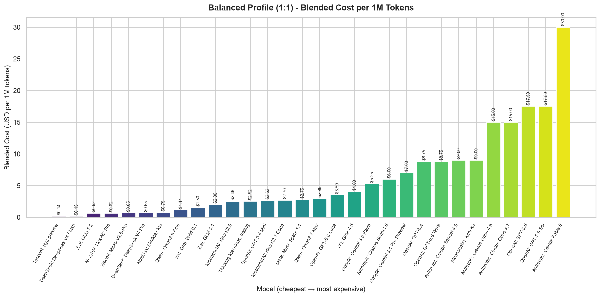
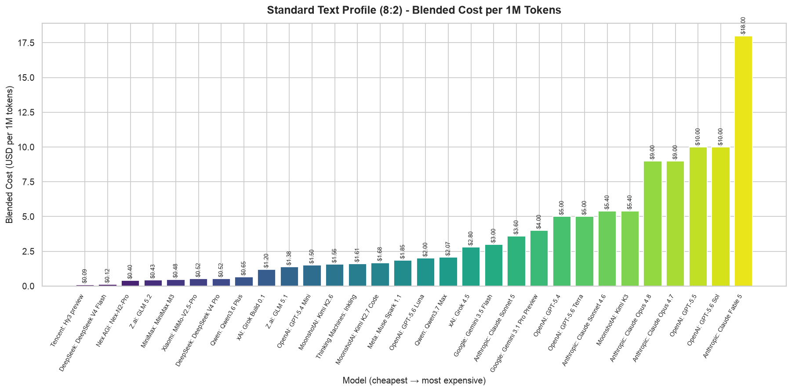

# LLM Pricing Index: July 18, 2026

Understanding LLM pricing is no longer just a procurement concern — it directly shapes product architecture, model selection, and margin structure for any AI-native application. With providers ranging from free-tier experiments to premium frontier models at $50/output-Mtok, the spread demands disciplined cost modeling.

## Methodology

To make pricing comparable across usage patterns, we compute **blended cost per 1M tokens** under three profiles. **Balanced (1:1)** assumes equal input and output volume — typical of conversational agents and general-purpose assistants. **Standard Text (8:2)** models 80% input / 20% output, reflecting RAG pipelines, chatbots processing large context, and summarization workloads. **Coding (9:1)** assumes 90% input / 10% output, matching scenarios where large codebases or files are ingested as context and completions are concise. Blended Cost = (Input Price × input fraction) + (Output Price × output fraction). All raw prices are in USD per 1M tokens.

## Findings

### Balanced Profile (1:1)

Anthropic's **Claude Fable 5** leads the high end at **$30.00/1M**, followed by OpenAI's **GPT-5.6 Sol** and **GPT-5.5**, both at **$17.50/1M**. On the low end, **NVIDIA Nemotron 3 Ultra (free)** is at **$0.00**, while paid contenders include **Tencent Hy3 preview** at **$0.14/1M**, **DeepSeek V4 Flash** at **$0.15/1M**, and **Xiaomi MiMo-V2.5** at **$0.21/1M**. The spread from cheapest paid model to most expensive exceeds 200×.

### Standard Text Profile (8:2)

The 8:2 profile compresses output-heavy spreads. **Claude Fable 5** remains most expensive at **$18.00/1M**, with **GPT-5.6 Sol** and **GPT-5.5** at **$10.00/1M**. At the bottom, **Hy3 preview** costs just **$0.09/1M**, **DeepSeek V4 Flash** **$0.12/1M**, and **Xiaomi MiMo-V2.5** **$0.17/1M**. The cost advantage of input-cheap models shrinks in this profile, but the absolute leaders in affordability remain the same.

### Coding Profile (9:1)

In coding-heavy workloads the gap narrows further. **Claude Fable 5** costs **$14.00/1M**, while **GPT-5.6 Sol** and **GPT-5.5** are at **$7.50/1M**. On the budget side, **Hy3 preview** runs **$0.08/1M**, **DeepSeek V4 Flash** **$0.11/1M**, and **inclusionAI Ring-2.6-1T** **$0.13/1M**. Models optimized for output efficiency (low output-to-input price ratio) gain relative advantage here — notably DeepSeek's lineup and Xiaomi's MiMo-V2.5 variants.

## Takeaway

The LLM pricing landscape spans four orders of magnitude, from free to $30/1M blended. For most production workloads, the 10–50× gap between frontier and budget models makes cost-conscious selection the single highest-leverage decision in an AI system's design. The emergence of sub-$0.15/1M models from Tencent, DeepSeek, and Xiaomi suggests the commodity tier is rapidly maturing — and the premium tier is holding firm.
