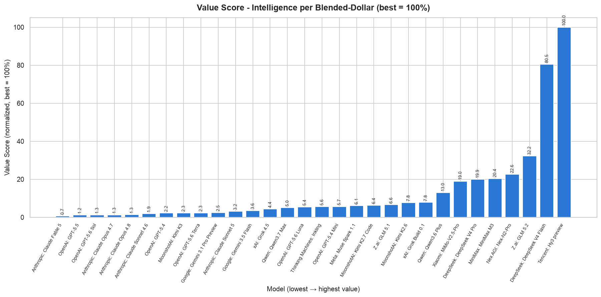
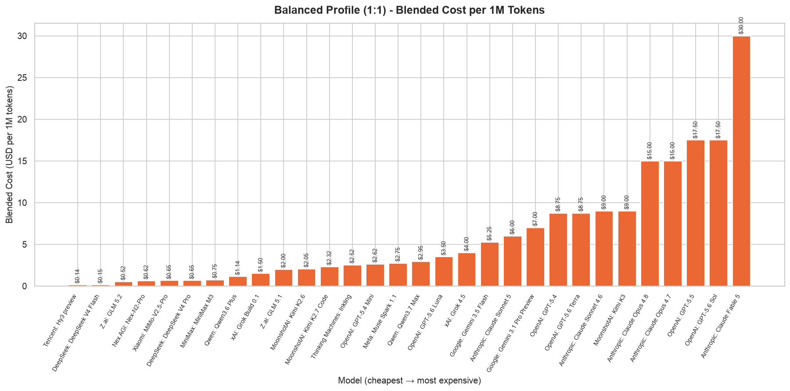
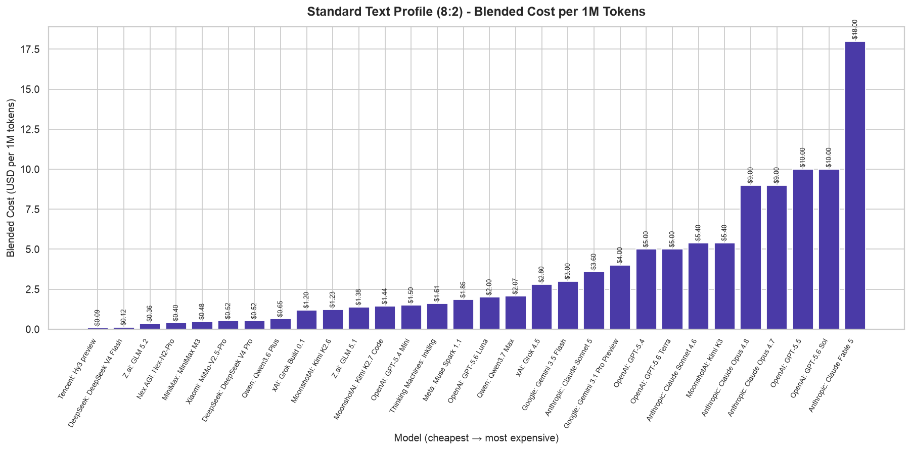
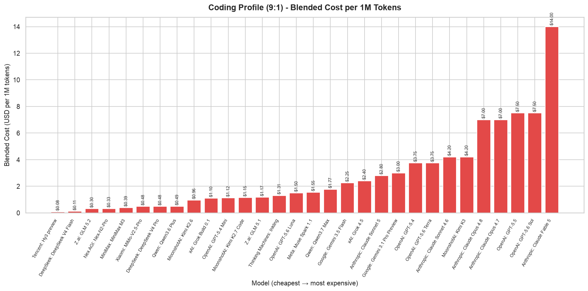
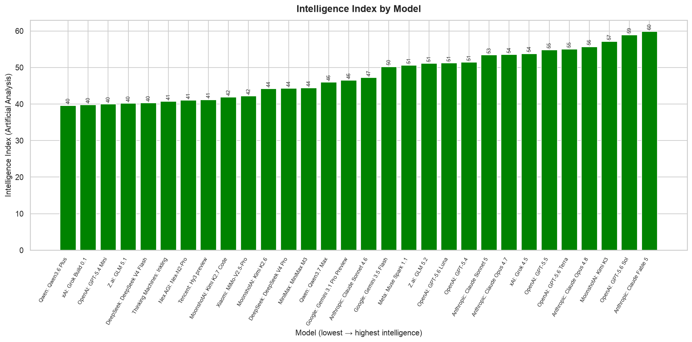

# LLM Pricing Index — July 19, 2026

As the frontier model race accelerates, the spread between the cheapest and most expensive LLMs now exceeds **200x** on a per-token basis — yet the priciest models are not always the smartest. This report ranks 30 leading models across three real-world usage profiles to surface which providers deliver the best intelligence per dollar.

## The Winner

**Tencent's Hy3 preview** is the undisputed value leader, earning a normalized Value Score of **100%** — more than 3x higher than the second-place model. With a total blended cost of just **$0.31 per 1M tokens** and an Intelligence Index of **41.2**, it delivers 403 intelligence points per dollar spent. The runner-up, **DeepSeek V4 Flash**, scores **80.5%** (total blended cost **$0.37**, Intelligence Index **40.3**), making it a strong alternative for cost-conscious deployments. At the opposite end of the spectrum, **Anthropic's Claude Fable 5** posts the worst value at **0.72%** — its top-tier Intelligence Index of **59.9** is overshadowed by a total blended cost of **$62.00 per 1M tokens**, making it over 200x more expensive than Hy3 preview per unit of intelligence.

## Methodology

Blended cost per 1M tokens is computed as `(Input Price × input_frac) + (Output Price × output_frac)` under three workload profiles: **Balanced (1:1)** — 50% input / 50% output tokens, typical of conversational AI; **Standard Text (8:2)** — 80% input / 20% output tokens, representative of RAG, chatbots, and summarization workloads; and **Coding (9:1)** — 90% input / 10% output tokens, modeling large codebase ingestion with concise completions. The Value Score combines all three profiles with the model's Artificial Analysis Intelligence Index to measure intelligence-per-dollar.

## Findings by Profile

**Balanced Profile (1:1).** The cheapest model is **Tencent Hy3 preview** at **$0.14 per 1M tokens**, followed by **DeepSeek V4 Flash** at **$0.15** and **MiniMax M3** at **$0.75**. The most expensive is **Claude Fable 5** at **$30.00**, a **220x** spread from the cheapest. The top five frontier models — Claude Fable 5, GPT-5.6 Sol, Claude Opus 4.8, GPT-5.5, and Claude Opus 4.7 — all cost **$15.00 or more**, placing them in a premium tier far above the rest of the field.

**Standard Text Profile (8:2).** **Tencent Hy3 preview** again leads at **$0.09 per 1M tokens**, with **DeepSeek V4 Flash** at **$0.12** and **MiniMax M3** at **$0.48**. The most expensive is **Claude Fable 5** at **$18.00**, an approximately **195x** spread. The 8:2 profile reduces blended costs for models with cheap input and expensive output pricing, favoring providers like DeepSeek and Tencent that keep output token costs low.

**Coding Profile (9:1).** **Tencent Hy3 preview** is cheapest at **$0.08 per 1M tokens**, with **DeepSeek V4 Flash** at **$0.11** and **MiniMax M3** at **$0.39**. The most expensive is **Claude Fable 5** at **$14.00**, an approximately **180x** spread. The 9:1 profile heavily weights input tokens, compressing the absolute spread but preserving the same relative ordering.

## Intelligence Leaders

Independent of cost, **Anthropic's Claude Fable 5** leads the pack with an Intelligence Index of **59.9**, followed by **OpenAI's GPT-5.6 Sol** at **58.9** and **MoonshotAI's Kimi K3** at **57.1**. The lowest-scoring model in the top 30 is **Qwen's Qwen3.6 Plus** at **39.6** — a 34% gap from the leader. Notably, the value champion **Tencent Hy3 preview** (Intelligence Index 41.2) ranks 24th in raw capability, underscoring that the most cost-effective option is not the most capable, but is competitive with models costing orders of magnitude more.

## Takeaway

The LLM pricing landscape is bifurcating: a premium tier (Anthropic, OpenAI) commands $15–$62 per 1M tokens for top-tier intelligence, while a value tier (Tencent, DeepSeek, MiniMax) delivers 80–100% of the intelligence at under $2 per 1M tokens. For most production workloads, the value tier offers a compelling trade-off — especially for Standard Text and Coding profiles where input-heavy pricing favors low-cost providers. The choice is no longer about capability alone; it is about matching the right model to the right cost profile.